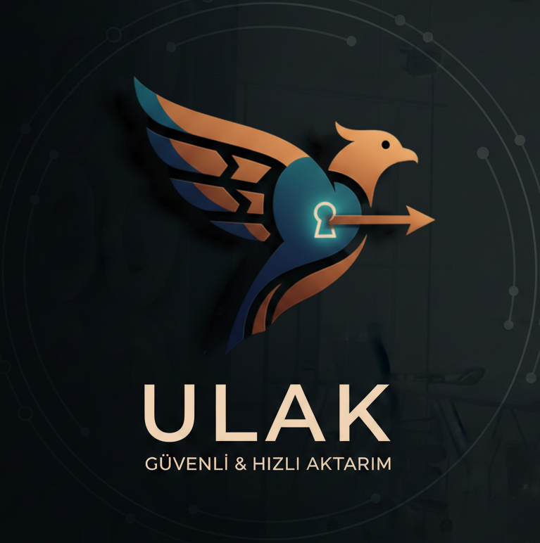

# Ulak — Güvenli & Hızlı Aktarım

<p align="center">
	
</p>

Ulak; **FastAPI backend + modern Web UI (Vite/React)** ve ayrıca opsiyonel **Flutter Windows masaüstü istemcisi** içeren, çoklu platform destekli güvenli dosya aktarım uygulaması.

## İçerik

- Backend: [backend/](backend/) — FastAPI, SQL Server (pyodbc), JWT auth, transfer oturumları, upload/download
- Web UI: [frontend/](frontend/) — Vite + React + TypeScript
- Flutter Windows istemci: [lib/](lib/) — masaüstü `.exe` (Flutter)
- Windows scriptleri: [scripts/windows/](scripts/windows/)

## Ekran görüntüleri

Bu bölümdeki görseller [docs/images/](docs/images/) altından yüklenir.

| Web Dashboard | Web Dosya Ver | Web Dosya Al |
|---|---|---|
|  |  |  |

| Web Ayarlar | Backend Swagger | Flutter Windows |
|---|---|---|
|  |  |  |

Not: Bu 6 görseli eklemek için dosyaları şu isimlerle [docs/images/README.md](docs/images/README.md) talimatına göre kaydedin.

## Hızlı Başlangıç (Windows)

### Önkoşullar

- Python 3.11+ (önerilen)
- Node.js 18+ (`npm` ile)
- SQL Server + **ODBC Driver 18 for SQL Server**

### 1) Kurulum (tek komut)

PowerShell:

```powershell
cd C:\Users\-\Desktop\ulak
./scripts/windows/setup.ps1
```

Script şunları yapar:

- `.venv` oluşturur ve backend bağımlılıklarını kurar
- `backend/.env` yoksa `backend/.env.example` kopyalar
- `frontend/` için `npm install` çalıştırır

### 2A) Dev mod (backend + frontend ayrı)

```powershell
./scripts/windows/run-dev.ps1
```

- Web UI: `http://localhost:5173`
- API: `http://localhost:8000`
- Swagger: `http://localhost:8000/docs`

### 2B) Tek servis mod (UI + API aynı port)

Bu modda Web UI build alınır ve backend, `frontend/dist` klasörünü servis eder.

```powershell
./scripts/windows/run-windows.ps1
```

- UI + API: `http://localhost:8000`

## Backend (FastAPI)

### Çalıştırma (manuel)

```powershell
cd backend
python -m uvicorn app.main:app --reload --host 0.0.0.0 --port 8000
```

### Ortam değişkenleri

Backend ayarları `backend/.env` içinden okunur.

Önemli alanlar (bkz. [backend/.env.example](backend/.env.example)):

- `DATABASE_URL`: SQL Server bağlantısı (SQLAlchemy URL)
- `JWT_SECRET`: JWT imzalama anahtarı (prod’da değiştirin)
- `CORS_ORIGINS`: Web UI origin listesi (virgülle)
- `IP_ALLOWLIST` / `IP_BLOCKLIST`: IP filtreleme (opsiyonel)

Not: Backend açılışında DB tabloları otomatik oluşturulur (ilk çalıştırmada bir kez).

## Web UI (Vite + React)

### Dev server

```powershell
cd frontend
npm install
npm run dev
```

Varsayılan:

- UI: `http://localhost:5173`
- Dev modda API istekleri Vite proxy üzerinden `http://localhost:8000`’e gider.

### Public backend’e bağlanma

Proxy kullanmadan doğrudan bir API adresine bağlamak için `frontend/.env` ekleyin:

```dotenv
VITE_API_BASE_URL=https://SENIN-PUBLIC-API-ADRESIN
```

## Flutter Windows (.exe)

Bu seçenek Web UI değil; **Flutter masaüstü istemcisi** içindir.

### Önkoşullar

- Flutter SDK (stable)
- Visual Studio 2022
	- Workload: **Desktop development with C++**
	- Windows 10/11 SDK

Kontrol:

```powershell
flutter doctor
```

### Debug çalıştırma

Backend çalışıyorken:

```powershell
cd C:\Users\-\Desktop\ulak
./scripts/windows/flutter-run.ps1 -ApiBaseUrl "http://localhost:8000"
```

Temiz derleme (cache sorunlarında):

```powershell
./scripts/windows/flutter-run.ps1 -ApiBaseUrl "http://localhost:8000" -Clean
```

### Release `.exe` üretme

```powershell
cd C:\Users\-\Desktop\ulak
./scripts/windows/flutter-build.ps1 -ApiBaseUrl "http://localhost:8000"
```

Çıktı:

- `build\windows\x64\runner\Release\ulak.exe`

## Ngrok ile farklı internetten erişim

Farklı ağlardan erişim için backend’i public bir URL’ye açmanız gerekir. Hızlı yöntem: **ngrok**.

### 1) Ngrok kurulumu + giriş

- https://ngrok.com/ adresinden hesap açın
- Authtoken alın ve ekleyin:

```powershell
ngrok config add-authtoken <TOKEN>
```

### 2) Backend’i ngrok ile yayınla

Backend `8000` portunda çalışırken:

```powershell
ngrok http 8000
```

Ngrok size şöyle bir adres verir:

- `https://xxxx.ngrok-free.app`

Bu URL üzerinden:

- Web (tek servis mod): `https://xxxx.ngrok-free.app`
- Swagger: `https://xxxx.ngrok-free.app/docs`

### 3) İstemcileri ngrok URL’sine bağlama

- Flutter:

```powershell
./scripts/windows/flutter-run.ps1 -ApiBaseUrl "https://xxxx.ngrok-free.app"
```

- React (prod / proxy’siz kullanım):

`frontend/.env` içine:

```dotenv
VITE_API_BASE_URL=https://xxxx.ngrok-free.app
```

Not: Vite dev server’ı da ngrok ile açacaksanız, host kontrolü için `frontend/vite.config.ts` içinde `allowedHosts` ayarı zaten eklenmiştir.

## Katkı / İletişim

- GitHub: MahmutSibal
- E-posta: mahmutsibal9@gmail.com
